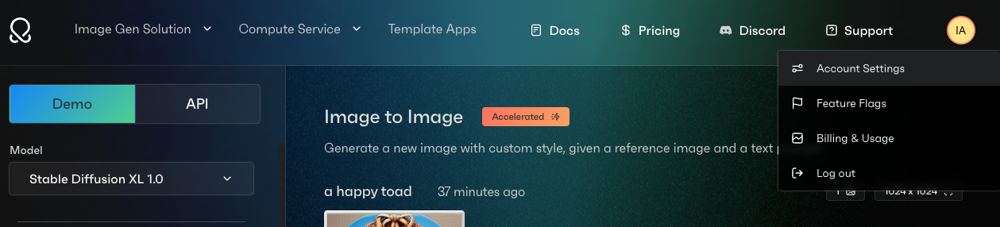
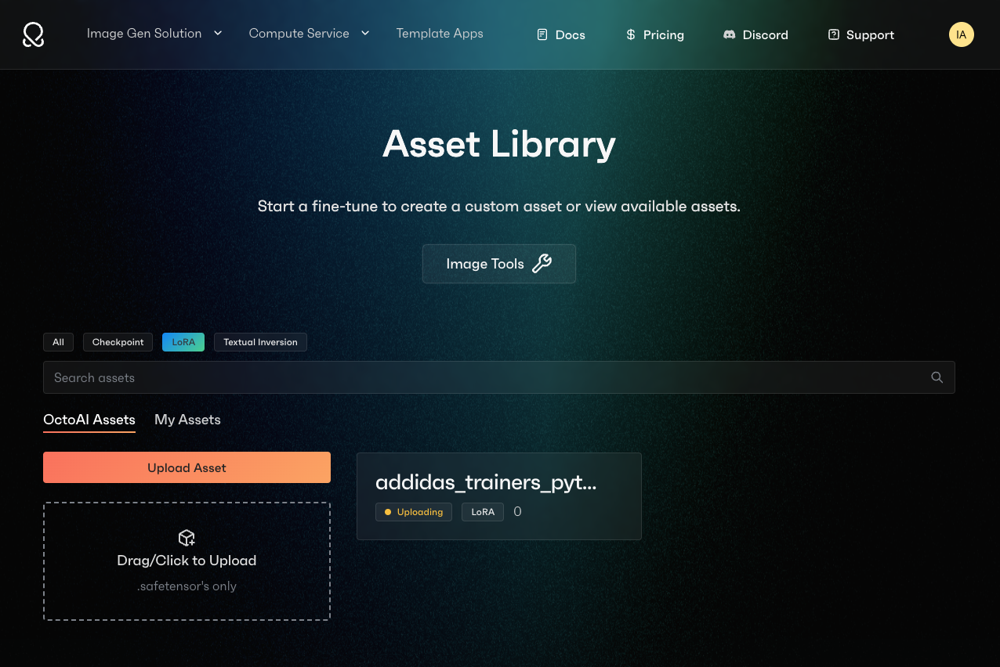
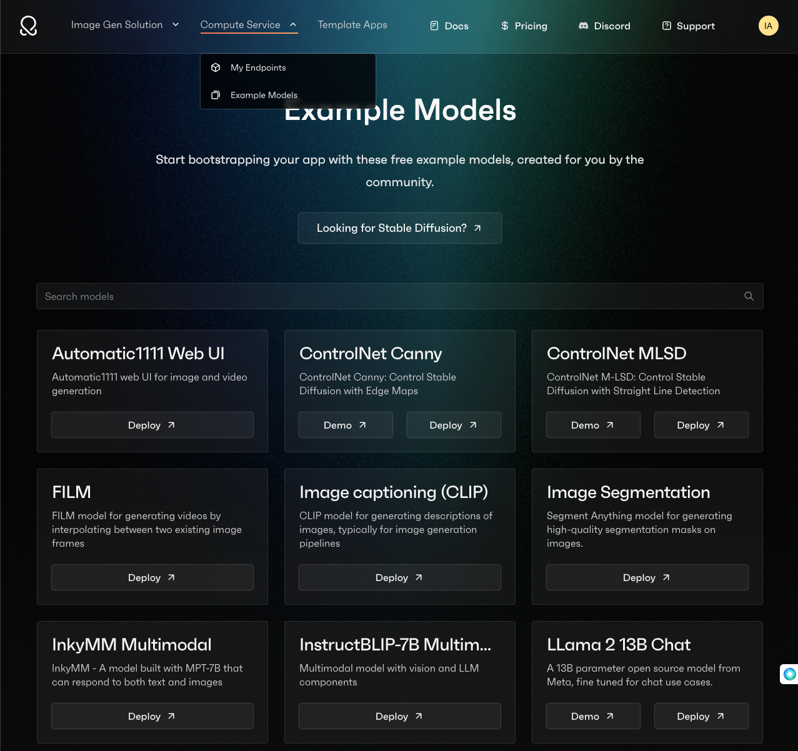
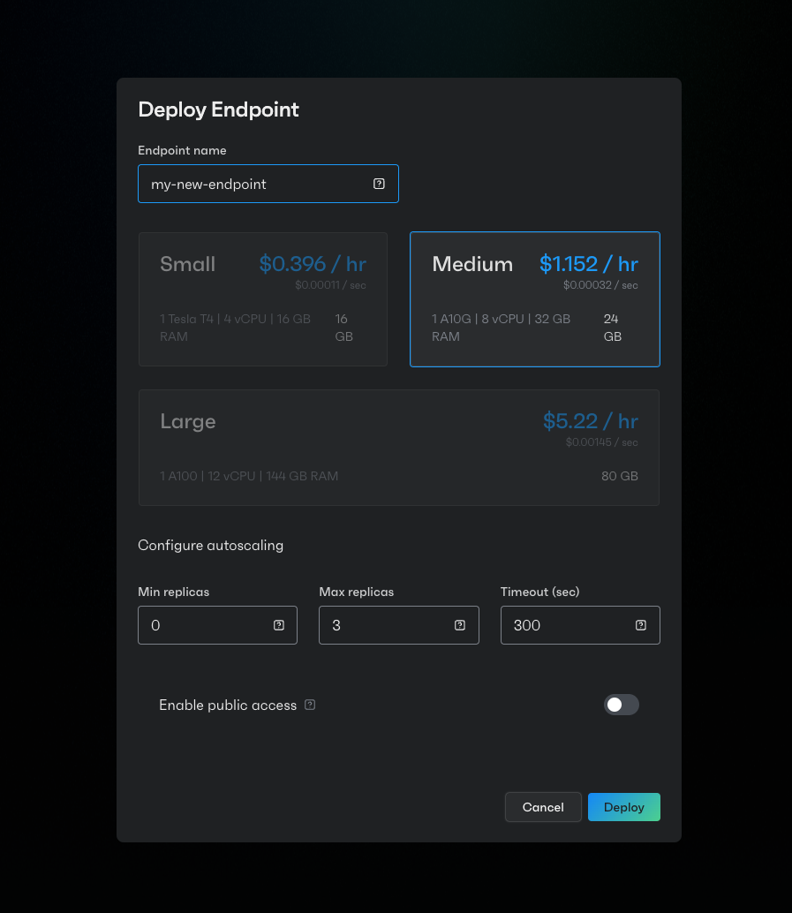

# Technical Screen | Build a Demo App with Streamlit, Powered by OctoAI 🦑
__Time Budget__: 2-4 hours

## Instructions 🖥️ 👓 📑
Build a demo python application for a prospect or customer that demonstrates the power and value of OctoAI's image generation vertical solution, powered by SDXL 1.0. 

You can use any demo application framework you like. We are fond of Streamlit and Gradio. 

When you are finished, please save or submit your application code and be prepared to give a brief presentation on what you built.


> * What is the use case you picked? Why?
> 
> * What is the business problem you were trying to solve?
> 
> * What is the technical problem you were trying to solve?
> 
> * How did you solve it?
> 
> * Tell us about anything else that helps a prospect or customer understand the value of OctoAI's image generation vertical solution, showcasing the speed and versatility of the platform

## Getting Started

Go to <a hre="https:octoai.cloud">octoai.cloud</a> to login and get started. Most of the tools you will need to complete this exercise will be found under the *Image Generation Solution* dropdown at the top of the page. 

> __NOTE__: We will provide a user for you to login in with so you don't hit any usage limits. 😎

### OctoAI Docs 
* [OctoAI Docs](https://docs.octoai.cloud/docs)
* [Image Generation](https://docs.octoai.cloud/docs/stable-diffusion-guide)
* [OctoAI CLI & Python SDK](https://docs.octoai.cloud/docs/installation-links)

### Get an Application Token
To use the SDK or the CLI, navigate to the settings and generate an account token. Save this token as an environment variable in your terminal.





```bash
OCTOAI_TOKEN=<my_new_token>
```

### Demo Image Generation Apps (examples)
 Our Developer Experience team has been steadily building out new demo apps, many of which are directed at creative and brand-focused content for e-commerce use cases. The lightbox app combines the best of OctoAI and the Image Generation solution to deliver a compelling e-commerce solution. The Stable Diffusion community at large is another great resource for inspiration. I've included some examples to get you started.

> Product-placement Lightbox App - 
https://www.loom.com/share/778a0bbf5d69474a8faf19d41e2fcb19

> SDXL 1.0 Community Examples
> * <a href="https://www.youtube.com/watch?v=LBTAT5WhFko">Create Ads with Automatic 1111+SDXL</a> 
> * <a href="https://mybyways.com/blog/scale-and-composite-latents-with-sdxl">Scale and Composite Latents with SDXL</a>


> Launch a bare-bones templated Streamlit app powered by OctoAI

```bash
pip install -r requirements.txt # installs streamlit, octoai-sdk, and pydantic
streamlit run eg_app.py
```

## OctoAI's Image Generation Vertical Solution: Setup

### Basic Usage using Text-to-Image
To generate your first image, follow these steps:
* Login to OctoAI (https://octoai.cloud) and click "Try Image Gen Solution". This will launch a Demo page for gernerating SDXL images from text prompts. 
* Click the "Generate" button to generate an image from the default prompt.
* Edit the prompt to generate different images. 

__NOTE__: The UI is designed to be self-explanatory and intuitive. Beyond this point, I've provided a basic examples of how to use the the Image Generation Solution's *Text-to-Image* modality. However, the best way to learn is to play around with the UI and see what you can create.


### Text-to-image | Customization
Customized image outputs can be achieved a number of different ways, by varying degrees of complexity. The most basic way to customize an image is hardcode part of the text prompt, producing similiar results each query. To achieve the best possible results, you can apply a combination of prompts, styles, LoRAs, textual inversions, and other parameters. 

#### Apply a style Preset
Apply a style from the "Style Preset" dropdown in the left-hand navigation bar and click generate. Your space-cat example will now render acording to the style you selected.

#### Apply a LoRA
LoRAs (sometimes called "fine tunes") are a resource-efficient way of achieving a very specific aesthetic or style, that may not be possible with a style preset. For example, you may want to generate a space-cat wearing a particular clothing brand or drinking a particular brand of soda. To reproduce this type of output without retraining the model, you can apply a LoRA. You can read more about LoRA's here. 

1. To use LoRAs, click the "LoRAs" tab in the left-hand navigation bar and select one of the pre-loaded public loras. 
2. The weight toggle adjusts the amount of influence the Lora has on the image.
3. Click "Generate" to generate an image with the selected Lora.


### Text-to-image | Code building blocks
You will have noticed already that the UI creates a code snippet each time you update your model input parameters. When you are happy with your image results, you can easily copy the code snippet to begin building your own custom application.


## Bonus Points
### Upload and apply a custom asset
<a href="https://octoai.cloud/assets?type=lora&public=false"> Upload a custom asset via the Asset Library UI</a> to the OctoAI platform and use it in your demo app. A LoRA is simple, extensible way to customize the base SDXL model and resultant image outputs. You can find loads of LoRAs at civitai.com.

Read more about LoRAs below.



### Use other models in your app
Call other models in your demo app to exert maximum control and effect over the output image. For example, you can use a large-language model, such as Llama-2-13, to improve the quality of your prompts. 

Additional model endpoints can be found in the <a href="https://octoai.cloud/models">Example Models</a> page, under the "Compute Service" drop-down at the top of the UI. 



You may be directed to create an endpoint for the model to secure the hardware resources neccesary to run it. 

Follow the instructions to create the endpoint, setting the number of min/max replicas, the hardware type, and the timeout. You shouldn't need more than a few replicas—I recommend using a10gs as these are cost-effective and plentiful.



At last, you will be directed to the model's endpoint page. 


